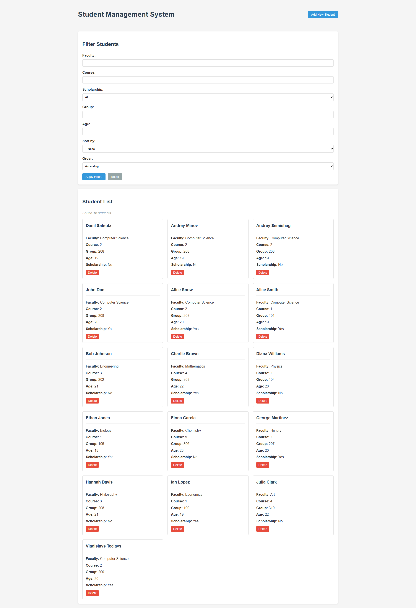
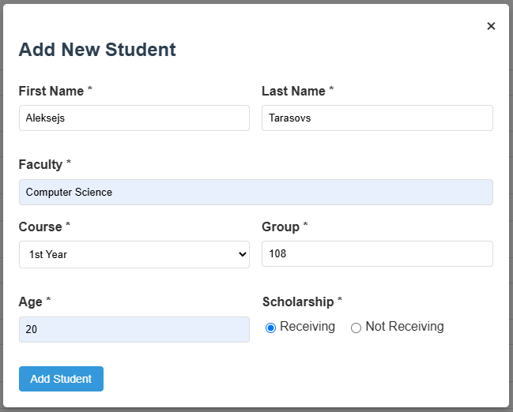
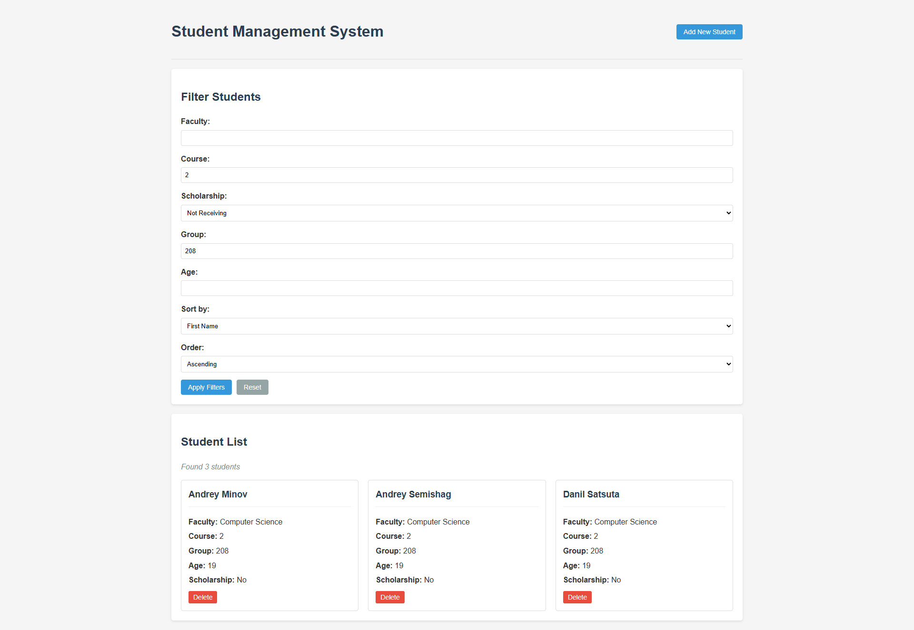

# Тема: MongoDB. Розглянути CRUD-операції та вибірку даних за різними критеріями.

Цей проєкт є практикою **Spring Boot**, розробленим для управління даними студентів з використанням **MongoDB** як база даних. Воно надає RESTful API для виконання операцій CRUD, фільтрації та сортування даних студентів на основі різних критеріїв.

## Функції

- **Операції CRUD**: створення, читання, оновлення та видалення записів студентів.

- **Фільтрація**: фільтрація студентів по факультету, курсу, статусу стипендії, групі або віку.

- **Сортування**: сортування результатів за тими самими полями в порядку зростання або зменшення.

- **Обробка помилок**: є відповіді на помилки для недійсних запитів або відсутніх даних.

## Що використовувалося в проєкті:

- **Java 17**
- **Spring Boot**
- **Spring Boot Starter Validation**
- **MongoDB**
- **Gradle**
- **Lombok**
- **ModelMapper**

## API

| HTTP Метод | Кінцеві точки                                    | Опис                                                                                                             |
|------------|--------------------------------------------------|------------------------------------------------------------------------------------------------------------------|
| GET        | `api/students`                                   | Отримати всіх студентів.                                                                                         |
| GET        | `api/students?group=208`                         | Отримати студентів з групою 208.                                                                                 |
| GET        | `api/students?group=208&age=19`                  | Отримати студентів з групою 208 та віком 19. (Комбінування фільтрів)                                             |
| GET        | `api/students?sort=course,desc`                  | Отримати студентів відсортованими за курсом у спадному порядку                                                   |
| GET        | `api/students?sort=course,desc&scholarship=true` | Отримати студентів відсортованими за курсом у спадному порядку та з наявною стипендію (Фільтрація та сортування) |
| POST       | `api/students`                                   | Створити нового студента.                                                                                        |
| GET        | `api/students/{id}`                              | Отримати студента за ID.                                                                                         |
| PUT        | `api/students/{id}`                              | Оновити студента за ID.                                                                                          |
| PATCH      | `api/students/{id}`                              | Частково оновити студента за ID.                                                                                 |
| DELETE     | `api/students/{id}`                              | Видалити студента за ID.                                                                                         |

## Візуалізація інтерфейсу (Створення, видалення, фільтрація та сортування студентів)
### Головна сторінка

### Створення нового студента

### Список студентів з фільтрацією та сортуванням

